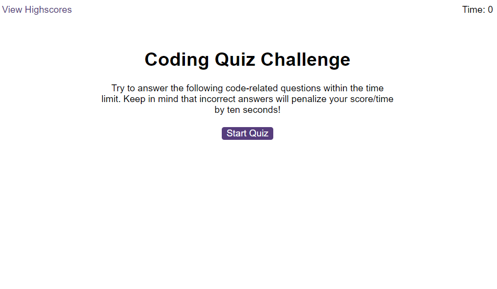
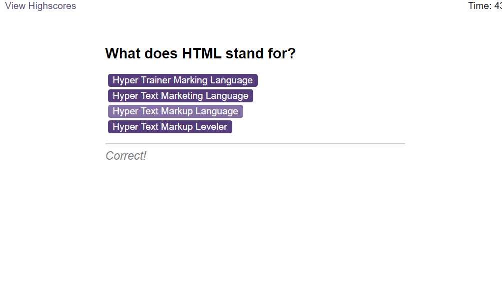
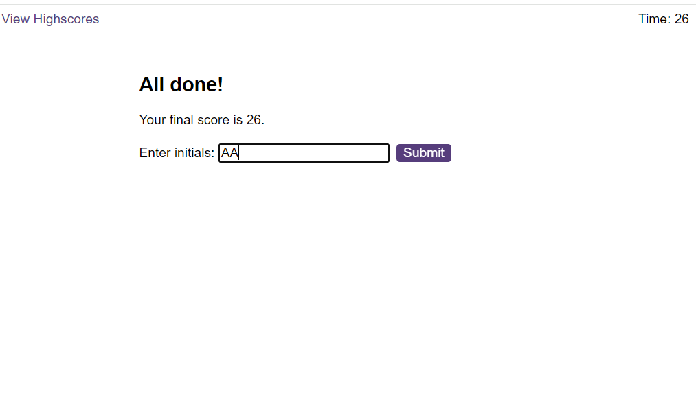
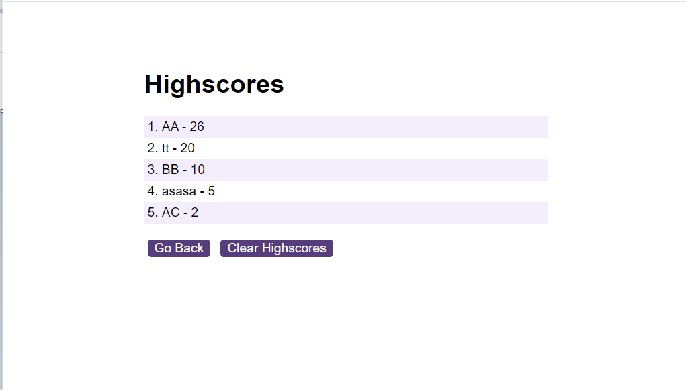

# Unit 6 Challenge: Code Quiz

## Description

The application is a timed, multiple-choice coding quiz that can keep track of high scores and quiz-takers' initials.

The site can be accessed at https://oleksiieng.github.io/coding-quiz/

###  Acceptance Criteria
**GIVEN** I am taking a code quiz  
**WHEN** I click the start button  
**THEN** a timer starts and I am presented with a question  

**WHEN** I answer a question  
**THEN** I am presented with another question  

**WHEN** I answer a question incorrectly  
**THEN** time is subtracted from the clock  

**WHEN** all questions are answered or the timer reaches 0  
**THEN** the game is over  

**WHEN** the game is over  
**THEN** I can save my initials and score

### Application Features:

- Start page with description.
- Quiz page.
- Storing results.
- Highscores.

## Table of Contents

- [Installation](#installation)
- [Credits](#credits)
- [License](#license)

## Installation

To install this project:

1. Clone the repository to your local machine using `git@github.com:Oleksiieng/coding-quiz.git`.
2. Open the project in VS Code or any preferred IDE.
3. Ensure you have a live server extension installed, or use a local server to view the web application.

## Credits

Resources consulted for learning purposes:

- [Mozilla Developer Network (MDN)](https://developer.mozilla.org/)
- [W3Schools](https://www.w3schools.com/)

## License

This site licensed under the [MIT license](https://opensource.org/licenses/MIT).
